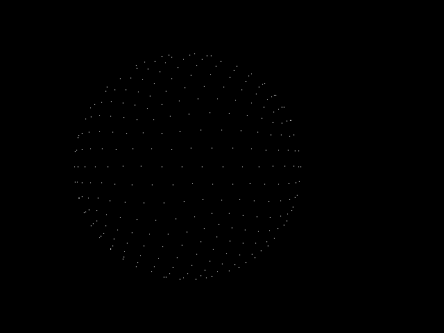
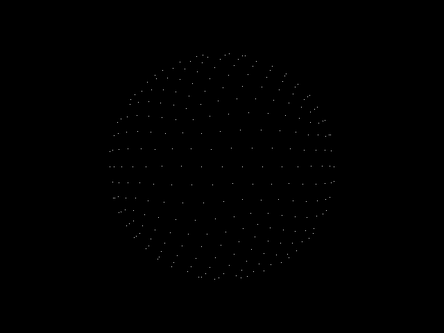
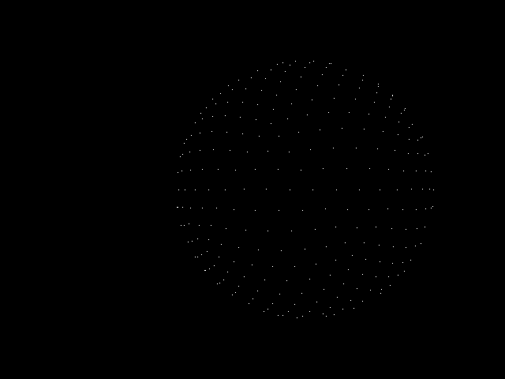
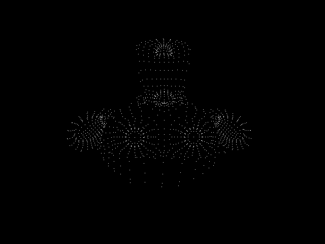
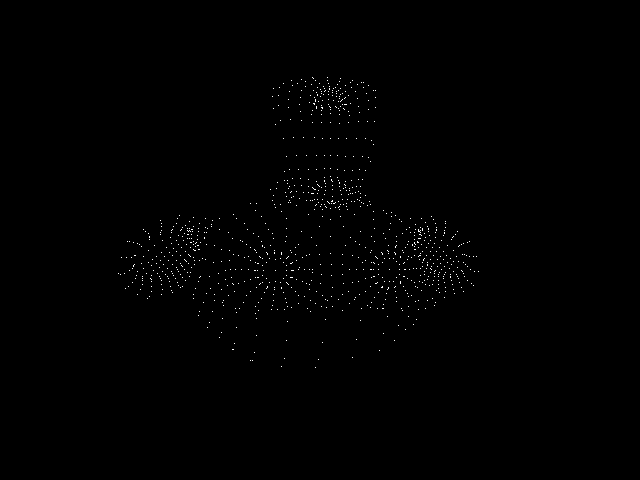
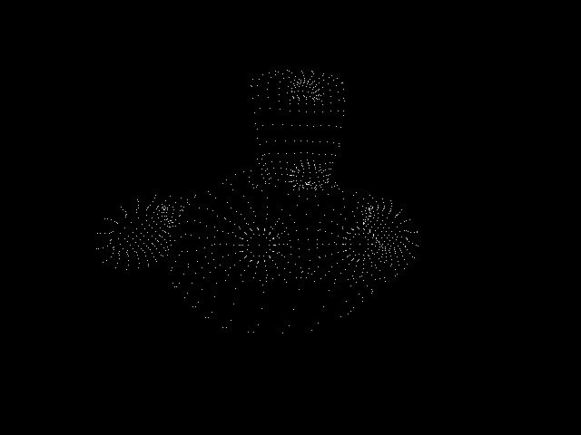
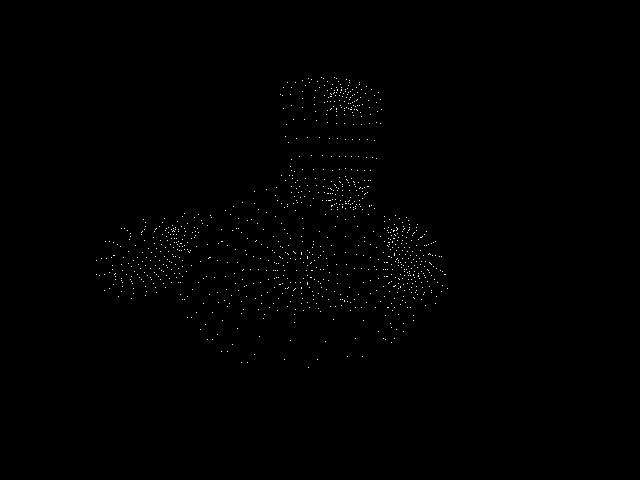
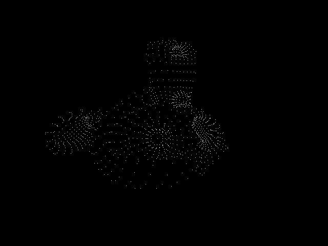
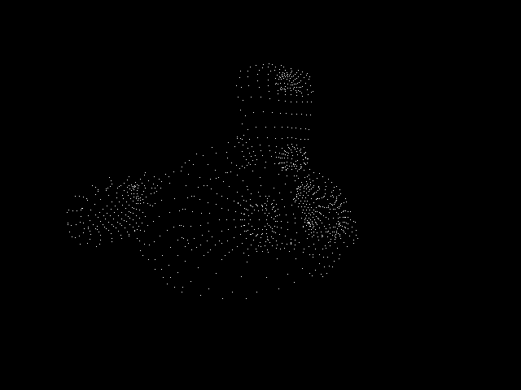
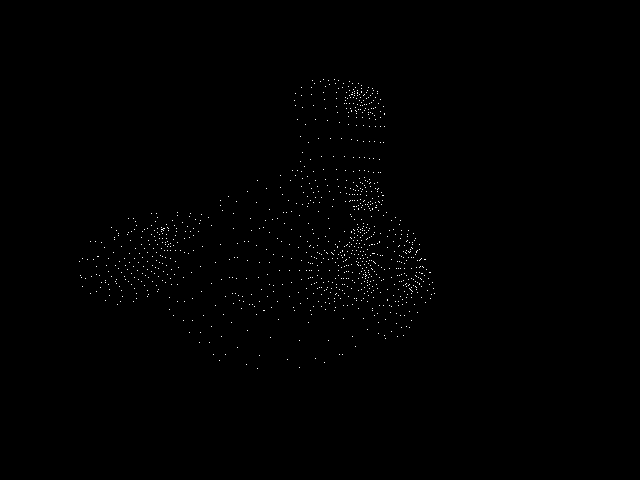

# models-cv
Crate for loading gltf/obj files and projecting the verticies using camera models. Used to crate ground truth features for SFM pipelines. 

See save_points examples on how the camera/trajectories are defined.

### Coordiante System
Currently the views/feautres are defined in the Computer Graphics coordinate system of +X Right, +Y Up, +Z Back

For a Computer Vision coordiante system roate poses around +X with a value of PI. For features invert the y component.

### Sphere

### Suzanne

### Assets

GLTF: https://github.com/KhronosGroup/glTF-Sample-Models/tree/master/2.0 (Suzanne)
OBJ: https://github.com/odedstein/meshes (Sphere)
